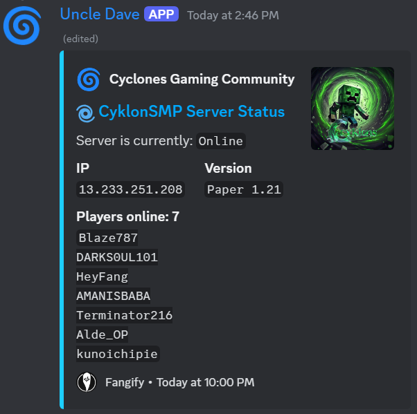

# Minecraft Server Stats Discord Bot
Keep your server community informed! This Discord bot automatically displays live statistics about your Minecraft server in a user-friendly embed format. It updates every 30 seconds, ensuring everyone has the latest information at their fingertips.

## Features:

1. Live Server Stats: Stay updated on key metrics like the number of players online, their names, version and server status.
<br>

<br>
2. Customizable Embed (Optional): Tailor the embed's appearance (colors, title, etc.) to match your server's theme (refer to Discord's documentation for details).<br>
3. Prerequisites: Ensure you have Node.js and npm (or yarn) installed on your system (download from https://nodejs.org/en).
   

## Set Up the Bot:

1. Clone this repository.
2. Install dependencies with `npm install` (or yarn install).
3. Configure the Bot:

Create a file named `config.json` in the project directory and add the following keys, replacing placeholders with your actual information:
```json
{
    "token": "YOUR_BOT_TOKEN",
    "clientId": "YOUR_BOT_CLIENT_ID",
    "guildId": "YOUR_DISCORD_SERVER_ID",
    "serverIp": "YOUR_MINECRAFT_SERVER_IP"
}
```
- You can obtain your bot token and client ID from the Discord Developer Portal: https://discord.com/developers/docs/intro.
- Your guild ID is your Discord server's unique identifier (find it in server settings).

## Run the Bot:
- use `node deploy-commands.js` to register commands.
- Use `nodemon run index.js` to start the bot with automatic restarting on code changes.

## Using the Bot:

Once the bot is running in your server, users can simply type the `/status` command to view the live server statistics embed.
