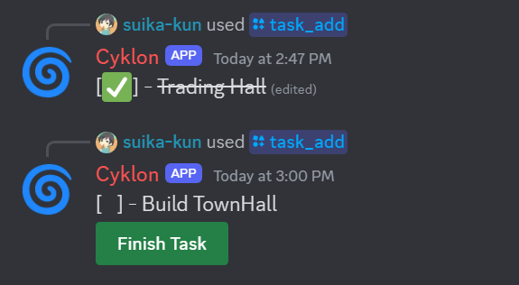
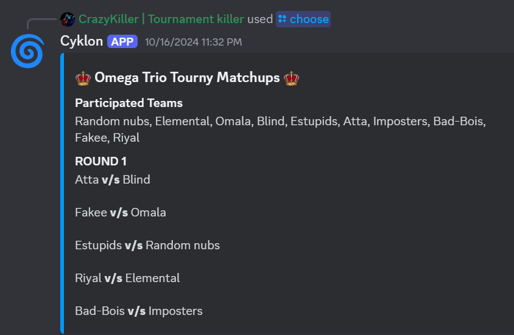

# Minecraft Server Stats Discord Bot
## Any contributions or suggestions are welcomed :>
View TODO.md to check out what stupid things are bonkin my head atm >.< <br> 
Keep your server community informed! This Discord bot automatically displays live statistics about your Minecraft server in a user-friendly embed format. It updates every 30 seconds, ensuring everyone has the latest information at their fingertips.

## Features:

1. Live Server Stats: Stay updated on key metrics like the number of players online, their names, version and server status.
<br>

<br>
2. Todo-list: Users can add and manage tasks with an interactive to-do list using the /task_add command and completion buttons.
<br>

<br>
3. MatchMaking: Command for random 1v1 pair-ups from given options.
<br>

<br>

<br>
5. Other trivial commands like /thank, /erase, /setactivity(to change bot activity through commad), etc.<br>
6. Prerequisites: Ensure you have Node.js and npm (or yarn) installed on your system (download from https://nodejs.org/en

   
## Set Up the Bot:

1. Clone this repository.
2. Install dependencies with `npm install` (or yarn install).
3. Configure the Bot:

Rename `config.example.json` to `config.json` in the project directory and replace the following keys with your actual information:
```json
{
    "token": "YOUR_BOT_TOKEN",
    "clientId": "YOUR_BOT_CLIENT_ID",
    "guildId": "YOUR_DISCORD_SERVER_ID",
    "serverIp": "YOUR_MINECRAFT_SERVER_IP",
    "port": "PORT",
    "allowedUsers": ["USER1_ID", "USER2_ID", "USER3_ID"]
}
```
- You can obtain your bot token and client ID from the Discord Developer Portal: https://discord.com/developers/docs/intro.
- Your guild ID is your Discord server's unique identifier (find it in server settings).

## Run the Bot:
- use `node deploy-commands.js` to register commands.
- Use `nodemon run index.js` to start the bot with automatic restarting on code changes.

## Using the Bot:

Once the bot is running in your server, users can simply type the `/status` command to view the live server statistics embed.
